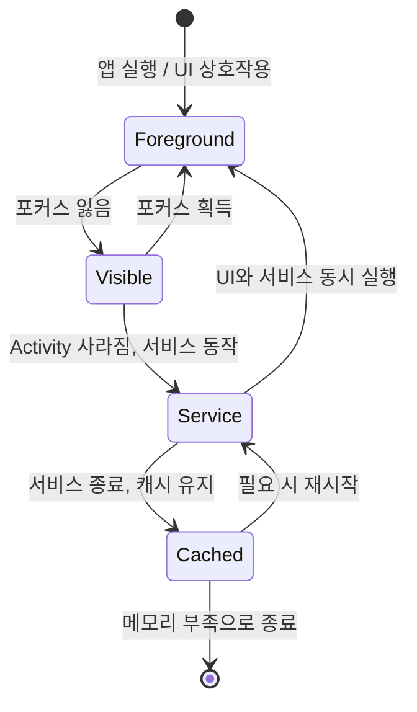
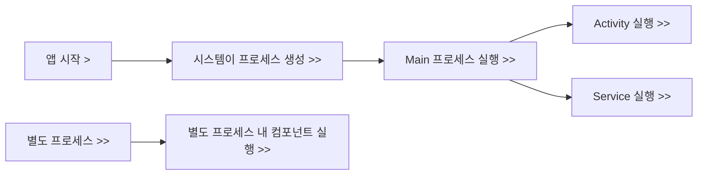

# 안드로이드 프로세스와 컴포넌트 실행 모델

안드로이드 애플리케이션은 리눅스 기반 시스템 위에서 동작하며, 각 애플리케이션은 시스템 호출인 `fork()`를 통해 **독립적인 프로세스**(Process)로 실행됩니다.
이 프로세스는 ART(Android Runtime) 또는 과거의 Dalvik 가상 머신 상에서 고립된 런타임 환경을 구성하며, 각 앱은 고유한 리눅스 UID(User ID)를 부여받아 **샌드박스(Sandbox)** 환경이 자동으로 구성됩니다. 
이로 인해 앱 간의 데이터 접근이 제한되며, 보안성, 독립성, 시스템 안정성이 확보됩니다.

<br>

## 1. 애플리케이션 컴포넌트와 프로세스 연결

안드로이드의 주요 컴포넌트는 기본적으로 하나의 프로세스에서 실행되지만, <br>`AndroidManifest.xml`의 `android:process` 속성을 사용하면 **컴포넌트마다 프로세스를 분리**할 수 있습니다.

```xml
<service
    android:name=".MyService"
    android:process=":remote" />
```

- `:remote`는 기본 프로세스가 아닌 **앱 내부의 별도 프로세스**를 생성함을 의미합니다.
- 같은 접두사를 공유하는 컴포넌트는 **동일한 별도 프로세스에서 실행**됩니다.
- `android:process`는 `<activity>`, `<service>`, `<receiver>`, `<provider>`, `<application>`에 모두 사용할 수 있습니다.

### 컴포넌트 간 프로세스 공유 조건
- **동일한 UID**를 갖는 애플리케이션 간에는 프로세스를 공유할 수 있습니다.
- **동일한 서명 인증서로 서명된 경우**만 가능합니다.

<br>

## 2. 안드로이드 프로세스 우선순위와 생명주기

안드로이드는 메모리 최적화를 위해 프로세스에 우선순위를 부여하고, 필요 시 **우선순위가 낮은 프로세스를 자동 종료**합니다.

| 우선순위 | 프로세스 유형         | 설명 |
|----------|------------------------|------|
| 1        | Foreground Process     | 사용자와 상호작용 중인 컴포넌트 (예: 포커스된 Activity) |
| 2        | Visible Process        | 사용자에게 보이지만 포커스는 없는 Activity (예: Dialog 뒤 Activity) |
| 3        | Service Process        | UI 없이 백그라운드 작업을 수행하는 Service |
| 4        | Cached Process         | UI에 보이지 않고, 재사용을 위해 메모리에 유지됨 |

- 시스템은 메모리 부족 시 Cached → **Service → Visible → Foreground** 순으로 종료 우선순위를 따릅니다.
- 종료된 프로세스가 다시 필요해지면, **컴포넌트 트리거에 의해 자동 재시작**됩니다.

### 프로세스 상태와 전환 예시 (Mermaid 다이어그램)



<br>

## 3. 보안 모델과 프로세스 샌드박싱

- 안드로이드의 프로세스는 **리눅스 커널의 사용자 격리(UID)**와 함께 완전히 **샌드박싱**되어 실행됩니다.
- 앱은 명시적인 권한이 없이는 **다른 앱의 데이터, 프로세스에 접근할 수 없습니다**.
- Android의 권한 시스템과 연동되어 시스템 및 사용자 데이터 보호를 강화합니다.

<br>

## 4. 실전 예시: 프로세스 구성 전략

### Q1. 컴포넌트를 별도 프로세스에서 실행하려면?

- `android:process=":custom"` 속성을 부여하면 컴포넌트는 별도 프로세스에서 실행됩니다.
- 주로 다음과 같은 경우에 사용됩니다:
  - **백그라운드 서비스의 내결함성 향상** (메인 프로세스 크래시 시에도 서비스 지속)
  - **리소스 집약적 컴포넌트 분리** (예: 무거운 WebView, 대용량 처리 등)

### Q2. 프로세스 종료를 방지하는 전략은?

- **Foreground 서비스**로 등록하면 높은 우선순위를 확보할 수 있습니다.
- **작업 우선순위에 따라 리소스 절약형 구조 설계** 필요
- ViewModel, SavedStateHandle을 활용해 **상태 복구 전략 마련**

<br>

## 5. 주요 컴포넌트와 프로세스 관계

| 컴포넌트         | 역할                               | 프로세스 관련성 |
|------------------|------------------------------------|------------------|
| Activity         | UI 화면 제공, 사용자와 상호작용   | 앱 실행 시 자동으로 프로세스 생성/종료 |
| Service          | UI 없는 백그라운드 작업 수행       | 메인 또는 별도 프로세스에서 실행 가능 |
| BroadcastReceiver| 시스템 이벤트 수신 및 처리        | 앱이 종료되어도 수신 가능 (프로세스 자동 시작) |
| ContentProvider  | 앱 간 데이터 공유 및 IPC 인터페이스| IPC 허용으로 보안상 별도 관리 필요 |

- 모든 컴포넌트는 `android:process`로 독립 프로세스로 분리 가능
- 안드로이드 시스템은 필요에 따라 컴포넌트를 실행하기 위해 **프로세스를 자동 생성**함

<br>

## 6. 프로세스와 컴포넌트 실행 흐름 예시



<br>

## 최종 요약

- 안드로이드는 각 **앱을 독립된 프로세스**로 실행하며, 컴포넌트 단위로도 **분리 가능**합니다.
- 프로세스는 **우선순위 기반으로 자동 관리되며**, 앱 생존성과 사용자 경험을 최적화합니다.
- 개발자는 `android:process` 속성을 통해 구조적 설계와 성능 최적화가 가능합니다.
- Activity, Service, BroadcastReceiver, ContentProvider는 안드로이드 앱 구조의 **핵심**이며, 프로세스 실행 흐름과 밀접하게 연결됩니다.

---
